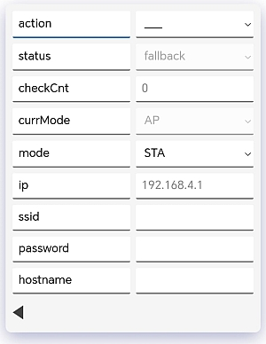

# SDDS_ESP_Extension
This is an extension from the [SDDS core library](https://github.com/mLamneck/SDDS) core library. It introduces some ESP specific functionalities. 
* WebSpike - webbased graphical userinterface
* WifiManager.

The WebSpike is using the **ESPAsyncWebServer** library from [me-no-dev](https://github.com/me-no-dev) to make use of a webserver and websockets. We want to thank him for his work here.

## Table of contents
- [Installation](#installation)
  - [Arduino](#arduino)
  - [PlatformIO](#platformio)
- [Web Spike](#webspike)
  - [Introducing the User Interface](#introducing-the-user-interface)
  - [Navigate through the tree on mobile devices](#navigate-through-the-tree-on-mobile-devices)
  - [Navigate through the tree on Desktops](#navigate-through-the-tree-on-desktops)
  - [Connect to the Access Point](#connect-to-the-access-point)
- [Wifi Manager](#wifimanager)
  - [What is a WiFi Manager](#what-is-a-wifi-manager)
  - [How does our Wifi Manager work](#how-does-our-wifimanager-work)
  - [Using the Wifi Manager](#using-the-wifimanager)
  - [Coding a full-featured Wifi Manager in 120 lines](#coding-a-full-featured-wifi-manager-in-120-lines)
    - [Declaring the Data Structure](#declaring-the-data-structure)
    - [Implementing the funcionality](#implementing-the-functionality)

## Installation


### Arduino
This library uses the following libraries which have to be installed first when using Arduino IDE.

 1. [SDDS Core Library](https://github.com/mLamneck/SDDS)
 2. [ESPAsyncWebServer](https://github.com/me-no-dev/ESPAsyncWebServer)
 3. Clone this repository in your library folder and you are ready to go.


### PlatformIO
Add the Github link to this repository as a lib dependency to your platformio.ini like in the following example.

```
[env:myEspEnv]
platform = espressif32
board = esp32dev
framework = arduino
lib_deps = https://github.com/mLamneck/SDDS_ESP_Extension
```

## WebSpike
The Web Spike does actually 2 things.
* It uses the [plain protocol](https://github.com/mLamneck/SDDS?tab=readme-ov-file#plain-protocol) to publish data over websockets
* It provides a website with a generic ui to interact with the data

You can test it best by flashing our [LED](/examples/led/led.ino) example code described in the [SDDS Core](https://github.com/mLamneck/SDDS?tab=readme-ov-file#example-for-this-documentation) example section. It includes the builtin components for parametersave and the WifiManager.

### Introducing the User Interface
Like mentioned in the [SDDS Core library](https://github.com/mLamneck/SDDS?tab=readme-ov-file#why-to-use-this-library), one of the key benefits of sdds is that you don't have to care about user-interfaces as they are created automatically based on the variables you are using in your program. In the following sections, we want to introduce the webbased user-interface provided by the WebSpike and give you some basics on how to use it. In order to access it, you have to connect to the Access Point (explained in the next section) created by the ESP and follow the link [http:://192.168.4.1](http:://192.168.4.1). Below is an illustration of how the user-interface of our LED example program will look like.


If you read something like set ```led.onTime=500``` in this documentation, we mean you follow the green line in the illustration enter a value of 500 and accept the change.

#### Navigate through the tree on mobile devices
When you browse the Website you will first see the picture on the left. We think the usage is self explainatory but here are some guidelines.
* Each variable in you tree is represented by 2 columns with the name in the left and the value in the right.
* For readonly variables, the font color in the right column is gray instead of black and the value can not be edited.
* Whenever you see ```>``` in the right column, it means this is a struct. You can navigate into that structure by clicking in the right column.
* You can navigate back to the parent struct by clicking the black left arrow at the bottom left.
* You non-struct variables, you can change the value by clicking in the right column with the current value. This will open up the soft keyboard or select dialog if it's an enum.

#### Navigate through the tree on Desktops
With a keyboard available you can navigate through the tree using the arrow keys. Up, down to select the current row indicated in the blue line below the name. With the right key you can navigate into substructures or start entering a value. Using the left key in the right column stops the editing process. Using the left key in the right column navigates back to the parent struct. While editing a value, enter accepts the value, excape cancels the editing process

### Connect to the Access Point
After flashing the code, the ESP will open an Access Point with the following credentials.

* **myExcitingSSID**
* **Start12345**
* **default IP = 192.168.4.1**

Connect to this hotspot and visit the configuration [http://192.168.4.1](http://192.168.4.1).

### Configure your Wifi Credentials.

* Naviage to ```wifi```
  * Enter your ssid
  * Enter your password
  * Enter the hostname that the ESP should have in your network. This will determine the URL you have to enter, so for example if you go for ```myNewEspProject```, you will have to enter [http://myNewEspProject](http://myNewEspProject) when it's connected to your router.
* Navigate to set ```params.action=save```
* restart your board

## WifiManager

### What is a WiFi Manager

ESP boards are amazing and connecting them to a router is fairly easy. However if you don't want to have hardcoded credentials you need a way to specify them at runtime. This is what a WifiManger does. There are a lot of WifiManagers out there, but we've implemented one on our own for a few reasons. 

* First of all we don't like to be dependend on other libraries if not necessary.
* Second the implementation of the logic is straightforward and we wouldn't even consider to search for a library. 
* Third and most important we use it as another example for proving our statement from the [SDDS Core Library](https://github.com/mLamneck/SDDS?tab=readme-ov-file#why-to-use-this-library) and show once more how you can tremendously speed up your developement process and how even beginners are able to do advanced stuff like a WifiManager. Check out our A full-featured WiFi Manager chaper in 120 lines [chapter](#coding-a-full-featured-wifi-manager-in-120-lines) if this sounds interesting.

### How does our WifiManager work?

The core functionality in short words is not more than the following. If it has no credentials stored it creates an Access Point and provides a Website to enter and store the credentials, so that with the next boot it's able to connect.

Our implementation is a bit more sophisticated:

1. Startup
2. Credentials stored?
    1. Try to connect
    2. Connected?
       1. Check if still connected every minute, and if not go to step 3.
    3. No connected?
       1. Create an Access Point with a website to configure it.
       2. After 5 minutes goto 2.1
3. Credentials not stored?
    1. Create an Access Point with a website to configure it.

Note that we are not rebooting the ESP and we also implemented a reconnect (The builtin auto-reconnect feature, still not works reliable on ESP. If you for example turn off your WiFi during the night, you will find your ESP not connecting in the morning. Thats why we have to check it on our own). And on the other hand if it cannot connect, it doesn't get stuck in the Fallback AP. Instead it opens the Fallback AP and tries to connect to your local network in 5 minute intervals.

### Using the WifiManager

Using our WiFi Manager is straightforward. Just include ```uWifiManager.h``` and add a ```TwifiManager``` struct in somewhere in your tree. See the following boilerplate code for an application using SDDS.

```C++
#include "uTypedef.h"
#include "uMultask.h"
#include "uParamSave.h"

#define WIFI_MANAGER_AP_SSID "myExcitingSSID"
#define WIFI_MANAGER_AP_PW "Start12345"
#include "uWifiManager.h"

class TuserStruct : public TmenuHandle{
    sdds_struct(
        sdds_var(TparamSaveMenu,params)
        sdds_var(TwifiManager,wifi)
    )
    TuserStruct(){
        //you application code goes here... 
    }
} userStruct;

#include "uWebSpike.h"
TwebSpike webSpike(userStruct);

void setup(){

}

void loop(){
  TtaskHandler::handleEvents();
}
```

#### Testing the WiFi Manager
You can use the [Led example code](examples/led/led.ino) in order to try it.


### Coding a full-featured WiFi Manager in 120 lines
#### Prerequisites
In order to follow along, it's benefitial to be familiar with the basics of the [SDDS Core library](https://github.com/mLamneck/SDDS?tab=readme-ov-file#documentation). But we think it's still possible to understand it right away and read some stuff on demand. Just try it yourself as you like.

There are a lot of WiFi Managers out there. If you have a look at the implemention, you will find a lot of code. It's going up to 10000 lines. We don't want to say anything against these libs - they might be great - but obviously the functionality described in [how does the WifiManager work](#how-does-our-wifimanager-work) does not justify such a huge codebase and the question is where does the effort go if not into the functionality?

Let's have a look at what's necessary to create a WiFiManger.
1. **The functionality**
    * piece of cake
2. **A Website with a Userinterface**
    1. Run a webserver on the ESP
    2. Write a Website with
        * HTML
        * CSS
        * Javascript
        * Post data to the ESP
        * Probably handle data coming from the ESP if you want some status updates 
    3. Handle posted data on the ESP
    4. Run websockets if you want to have status updates.
3. **Save the data to non-volatile memory**
    * use EEPROM or SPIFFS

Obviously part 2 is the biggest requires the most knowledge. For sure it's overwhelming for beginners and even advanced developers won't do it in 30 minutes. And finally you have to accomlish step 3 and test everything, which is not to underestimate as well.

Reading over the list, with the goal in mind, I get in a bad mood and I wouldn't even start. So much effort for such a simple task!? Let's see if we can do it less painless with SDDS.

#### Declaring the Data Structure

We start by creating a new file ```uWifiManager.h``` and brainstorm about the data-structure we need.
```C++
sdds_enum(no,yes) TwifiSwitch;
sdds_enum(STA,AP) TwifiMode;
sdds_enum(connect,waitConnect,connected,fallback,idle) TwifiStatus;

class TwifiManager : public TmenuHandle{
    Ttimer timer;
    public:
        sdds_struct(
            sdds_var(TwifiSwitch,enabled,sdds::opt::saveval,TwifiSwitch::e::yes)
            sdds_var(TwifiStatus,status,sdds::opt::readonly)
            sdds_var(Tuint8,checkCnt,sdds::opt::readonly);
            sdds_var(TwifiMode,currMode,sdds::opt::readonly)
            sdds_var(TwifiMode,mode)
            sdds_var(Tstring,ip,sdds::opt::readonly)
            sdds_var(Tstring,ssid,sdds::opt::saveval)
            sdds_var(Tstring,password,sdds::opt::saveval)
            sdds_var(Tstring,hostname,sdds::opt::saveval)
        )
        TwifiManager(){
          //logic goes here
        }
```
This will look like the following in the user-interface provided by the WebSpike. Note that this is not a fixed thing that we did behind the scenes, it is created based on the structure you have defined above, so adding variables in the above struct will add it in the UI without any further doing.



Most of the variables are self-explainatory, some might not:
* enabled

    probably we want to disable WiFi at all to save energy. This might not make a lot of sense because without WiFi you need no WifiManager but there are szenarios where it might be useful anyway
*  currMode

    the mode the WiFi module is currently in (STA/AP)
* mode

    probably we want the ESP to create an Acess Point with given ssid and password instead of connecting to our router.

#### Implementing the Functionality

Our business logic goes into the constructor of our TwifiManager class and all the following code snippets will be located there. First of all we need to inialize the WiFi module.

```C++
...
class TwifiManager : public TmenuHandle{
  ...
    TwifiManager(){
        on(sdds::setup()){
            WiFi.begin();
        };
    }
```
The ```on(sdds::setup()){...}``` is basically equivalent to the ```setup(){...}``` in typical Arduino programs. But because we want to write independent components we need a way to do the component related inialization in that component.

Ok let's continue with the logic for the ```enabled``` switch:
```C++
on(enabled){
    if (enabled==TwifiSwitch::e::yes){
        status = TwifiStatus::e::connect;
        timer.start(100);
    }
    else {
        disconnect();
        status = TwifiStatus::e::idle;
        timer.stop();
    }
};
```
If the switch is enabled (```enabled==TwifiSwitch::e::yes```) we set our status variable to connect and start our timer in order to run the statemachine we will implement. If not enabled, we call a method disconnect (find it in the full code, but for sure you will guess what's in it).

Let's continue with the first of 3 states in our statemachine. The **connect** state.
```C++
timer.start(100);
on(timer){
    switch(status){
        case TwifiStatus::e::connect: case TwifiStatus::e::fallback:
            if ((ssid.value().length() > 0) && (password.value().length()>0))
                if (mode==TwifiMode::e::STA){
                    connect();
                    checkCnt = 0;
                    status = TwifiStatus::e::waitConnect;
                    timer.start(500);
                } else createAP();                        //create AP with given credentials
            else createFallbackAP();                      //create fallbackAP if credentials are not set
            break;
```
This can be read like this:
* We have stored credentials?
    * We want to use the stanionary mode (connect to a router)?
      * call connect() to start the connecting process.
      * switch state to the next phase -> wait to be connected
    * Or we want to create an AP with the given credentials
      * create the AP
* We don't have stored credentials?
    * create a fallback AP

The next state is **waitConnect**:
```C++
case TwifiStatus::e::waitConnect:
    timer.start(1000);
    checkCnt = checkCnt+1;
    if (connected()) status = TwifiStatus::e::connected;
    else if (checkCnt >= 10){
        //create fallback if no connection has been established with the
        //provided credentials and try to connect again after 5 minutes
        createFallbackAP();
        timer.start(60000*5);
    }
    break;
```
Here we are basically checking every second if we are connected and if not after 10 checks (10 seconds), we create the fallback AP and start a timer with 5 minutes. In the ```createFallbackAP()``` we set the state to fallback which means after 5 minutes we are going back to phase 1 which will try to connect again. 

This is what we want. If you turn your WiFi off during nighttime it will try to connect every 5 minutes and will be connected in the morning. But if you changed your ssid or something else happened so that it cannot connect anymore, you can still catch in AP mode to configure it without the need of a reboot.

If we are finally connected we switch the state to connected, the final state **connected**:

```C++
case TwifiStatus::e::connected:
    if (connected()) timer.start(60000);
    else {
        status = TwifiStatus::e::connect;
        timer.start(100);
    }
```

Here we are checking every minute if we are still connected, and if not we set the state back to **connect** to start all over again. The **connected** state is necessary because the auto-reconnect-feature of the ESP is still not reliable and we have to do it on our own.

And that's it! We just have to implement a few functions that will contain the code you are most likely familiar with. Check out the full code in the [source file](src/uWifiManager.h). How amazing is that? No need to know about html, css, javascipt, websockets, ...  and all the stuff that actually has nothing to do with what we wanted to implement. You get it for free. That's the beauty of SDDS. We hope that after seeing the real world example, you see the benefits it as clear as we do.
